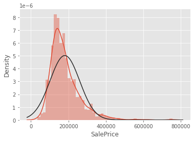
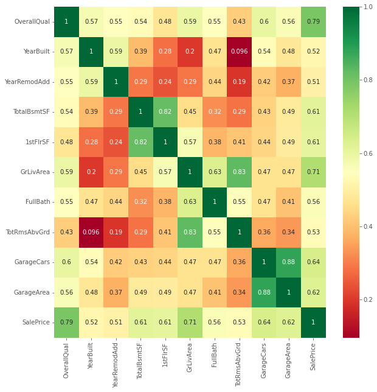
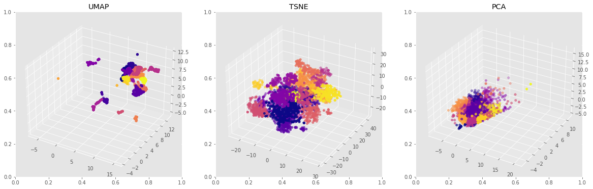
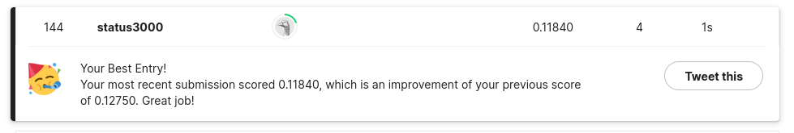

# Data analysis and implementation of ML models
Competition - [House Prices - Advanced Regression Techniques](https://www.kaggle.com/c/house-prices-advanced-regression-techniques/overview)

Done:
- Data preprocessing

- Feature engineering
- Models training: GradientBoosting, XGBoost, LGBM, Catboost
- Hyperparameters tuning with Optuna

- Feature analysis

- Clustering with a KMeans, AgglomerativeClustering algorithm and dimension reduction techniques: PCA, t-SNE and UMAP

- Best result: __TOP 2%__ (144th place out of 5172) with a RMSLE metric __0.11840__

